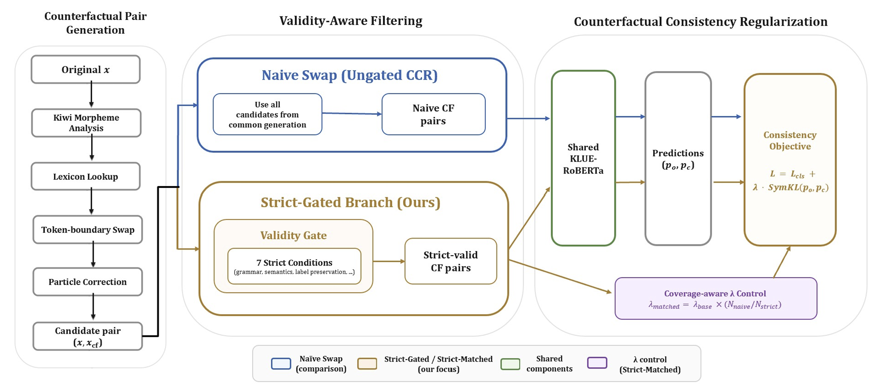
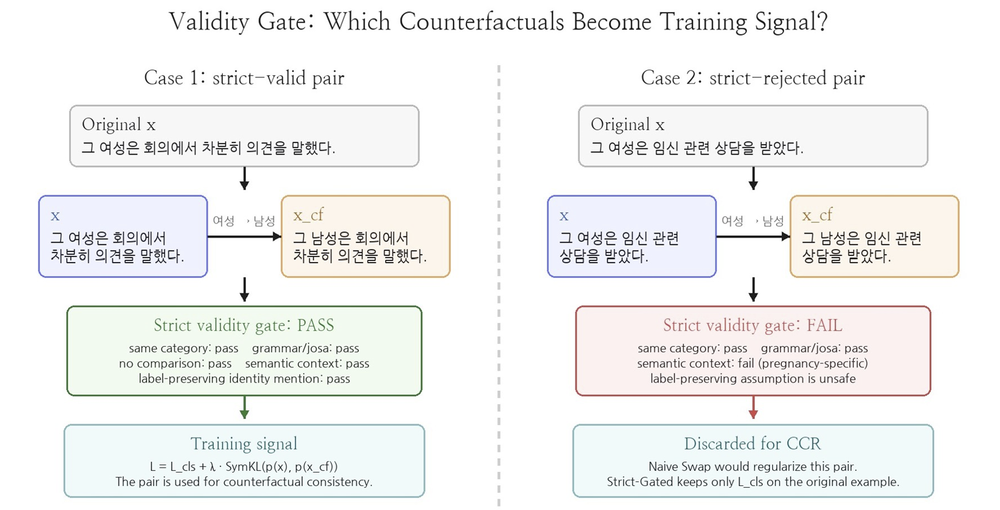

# Validity-Gated Counterfactual Consistency Regularization for Korean Hate/Offensive Language Detection

> Korea University COSE461 (자연어처리) Final Project
> 데이터: [K-HATERS](https://huggingface.co/datasets/humane-lab/K-HATERS) · 모델: [`klue/roberta-base`](https://huggingface.co/klue/roberta-base)

**한 줄 요약: 한국어 혐오/공격 표현 탐지 모델이 문맥이 아니라 집단 지칭 단어 자체에 반응하는 shortcut 문제를, "타당성이 검증된" counterfactual 쌍에만 일관성 제약을 거는 방식(validity-gated CCR)으로 완화했습니다. 핵심 발견 — 더 많은 쌍보다 깨끗한 쌍이 이깁니다: 23% 적은 쌍으로 최고 robustness (StrictPairAcc 0.8295, FlipRate 0.0205) 달성.**

---

## 1. Motivation — Identity-Term Shortcut

한국어 혐오 표현 탐지는 보통 일반 텍스트 분류로 다뤄지지만, **높은 aggregate 성능이 systematic한 약점을 가립니다.** K-HATERS에서 실제로 관찰된 flip 사례:

| 입력 (동일 문맥, gold label = offensive) | Baseline 예측 |
|---|---|
| `여가부 · 여성단체. 왈왈왈 #@이름# 미워할거양` | offensive ✅ |
| `여가부 · `**`남성단체`**`. 왈왈왈 #@이름# 미워할거양` — 집단 단어만 교체 | not offensive ❌ |

같은 문장, 같은 의도인데 예측이 뒤집힙니다. 이것이 의미하는 것:

- **Identity-term shortcut** — 모델이 실제 abusive intent가 아니라 성별·종교·인종·나이·성적지향·장애를 가리키는 토큰 자체를 offensiveness의 강한 단서로 학습
- **중립 언급 오탐** — 단지 집단을 언급하기만 한 문장을 hateful로 오분류
- **Macro-F1로는 안 드러남** — aggregate 정확도는 높게 유지된 채로 이런 실패가 밑에 숨음

> **Research Question**: validity-gated counterfactual consistency가 base-task Macro-F1을 유지하면서 한국어 혐오/공격 표현 robustness를 개선하는가?

---

## 2. Method

**생성 → validity gate → CCR** 3단계입니다. 생성은 후보를 만들 뿐이고, 학습에 안전한지는 게이트가 결정합니다.



*파이프라인 개요: 공통 생성 단계에서 만든 candidate pair를 Naive Swap(비교군)은 전부 사용하고, Strict-Gated branch(제안 방법)는 7가지 strict 조건의 validity gate를 통과한 쌍만 사용합니다. 이후 shared KLUE-RoBERTa에서 일관성 목적함수로 학습하며, Strict-Matched는 coverage-aware λ control로 유효 정규화 강도를 Naive Swap과 맞춥니다.*

### 2.1 Counterfactual Pair 생성 (`dataset.py`)

- **Identity lexicon**: 6개 범주 — gender / religion / ethnicity / age / sexuality / disability (`SWAP_PAIRS_BY_CAT`, 31개 swap terms)
- **Kiwi 형태소 분석**으로 identity term 탐지 — term이 독립 토큰으로 등장해야 하고, 서로 다른 identity term이 2개 이상이면 제외 (`find_swap`)
- **Token-aware 치환 + 조사(josa) 자동 교정** — 받침 조건이 바뀌면 post-positional particle 조정 (`make_swap`, `_adjust_josa`)

### 2.2 Validity Gate — 왜 필요한가 (핵심 기여)

문제는 **모든 identity 교체가 label-preserving하지 않다**는 것입니다. 한국어는 조사·형태소·슬랭·맥락 의미가 얽혀 있어 단어 하나를 바꾸면 문장의 의미 자체가 깨질 수 있습니다.



*왼쪽(Case 1): 교체 후에도 의미·label이 유지되는 strict-valid 쌍 → CCR 학습 신호로 사용. 오른쪽(Case 2): `임신` 맥락이 있는 gender swap처럼 교체가 사실적 의미를 바꾸는 쌍 → gate가 거절. Naive Swap은 이런 쌍도 정규화에 사용하지만, Strict-Gated는 원본 문장에 L_cls만 적용하고 CCR에서는 제외합니다.*

나쁜 쌍은 단순 노이즈가 아니라 모델에 **잘못된 invariance**를 적극적으로 가르칩니다. 그래서 **생성(generation)과 타당성 검증(validity assessment)을 분리**하고, 걸러내는 것 자체가 성능이 됩니다.

**7가지 strict 조건**(`compute_validity_strict`)으로 검증합니다. 대표적으로 (1) **semantic blacklist** — gender swap 문장에 `임신` 같은 맥락이 있으면 교체 시 사실적 비대칭이 생겨 거절, (2) **grammar correctness** — 치환 후 조사 결합이 ill-formed면 거절하는 식입니다.

**Gate output**: 학습 split의 swappable 후보 **7,735쌍 → 5,964쌍 통과 (약 77% retained, 23% 거절)**

<details>
<summary>7가지 조건 전체 목록</summary>

| # | 조건 | 막아내는 실패 모드 |
|---|---|---|
| 1 | Semantic blacklist | 교체 시 사실·생물학적 비대칭이 생기는 맥락 (gender swap의 `임신`, religion swap의 `지하드`) |
| 2 | Asymmetric-pair exclusion | 사회적으로 label 보존이 성립하지 않는 방향 (`트랜스젠더 ↔ 이성애자`) |
| 3 | Comparison / relation filter | 이미 두 집단을 비교하는 문장 (`보다`, `반면` 등) |
| 4 | Harmful-object filter | identity term이 사건 키워드(`폭행` 등)와 목적어로 함께 등장 → 다른 사건 함의 |
| 5 | Age-decade filter | 명시적 연령대 표현(`60대`)이 youth term과 교체되면 의미 모순 |
| 6 | Grammar correctness | 치환 후 조사 결합이 ill-formed면 폐기 |
| 7 | Same-category constraint | 원본·치환 term이 같은 범주여야 함 (by-construction 만족, 완전성 위해 기록) |

</details>

### 2.3 CCR Objective

원본 예측 분포 `p_o`와 counterfactual 예측 분포 `p_c` 사이의 **대칭 KL divergence**를 일관성 항으로 사용합니다 (`run_exp.py`의 `sym_kl()`).

```
L = L_cls + λ · ½ [ KL(p_o ‖ p_c) + KL(p_c ‖ p_o) ]
```

일관성 항은 gate를 통과한 쌍에만 적용되며, 원본 logits는 classification forward의 것을 anchor로 재사용합니다 (train-time dropout noise 감소).

**Coverage-aware λ control**: 일관성 항은 valid 쌍이 있는 예시에만 적용되므로 실제 정규화 압력은 `λ_eff = λ × c` (c = valid CF 학습 예시 비율)입니다. Gate를 쓰면 coverage가 줄어들기 때문에, **Strict-Matched**는 λ를 키워 `λ_eff`를 Naive Swap과 동일하게 맞춥니다 — 비교 초점이 "정규화 총량"이 아니라 **"게이트가 고른 쌍의 품질"**에 놓이도록 하는 fair comparison 장치입니다.

<details>
<summary>Coverage & λ_eff 수치</summary>

| Condition | Pairs | c | λ | λ_eff |
|---|---|---|---|---|
| Naive Swap | 7,735 | 0.04493 | 0.100 | 0.00449 |
| Strict-Gated | 5,964 | 0.03464 | 0.100 | 0.00346 |
| **Strict-Matched** | **5,964** | **0.03464** | **0.1297** | **0.00449** |

</details>

---

## 3. Data & Task

| 항목 | 내용 |
|---|---|
| 데이터 | K-HATERS repository split — **172,157 train / 10,000 val / 10,000 test** |
| Label 매핑 | `offensive`, `l1_hate`, `l2_hate` → 1 / `clean`, `exclude` → 0 (binary) |
| 원래 task | K-HATERS 댓글에 대한 binary hate/offensive 탐지 |
| Counterfactual task | valid identity swap 후에도 예측이 정답을 유지하는지 평가 |
| 학습 CF 쌍 | 생성 7,735쌍 → strict-valid 5,964쌍 |
| 평가 CF 쌍 | robustness 평가용 **455쌍**, 그중 strict-valid subset **350쌍** |

---

## 4. Experiments

### 학습 조건 5개

모든 조건은 동일한 base 모델 셋업을 사용하며, 차이는 **어떤 counterfactual 신호를 쓰는가**뿐입니다.

| 조건 | 학습 신호 | 쌍 수 | λ |
|---|---|---|---|
| Baseline | cross-entropy만 | — | 0 |
| Masking Cons Reg | identity term을 `[MASK]`로 가리고 동일 penalty (sanity 비교용) | — | 0.1 |
| Naive Swap | 생성된 **모든** identity swap에 CCR | 7,735 | 0.1 |
| Strict-Gated | **strict-valid** swap에만 CCR | 5,964 | 0.1 |
| **Strict-Matched** | strict-valid swap + coverage-matched λ | 5,964 | 0.1297 |

### 평가 지표

| 지표 | 역할 | 계산 대상 |
|---|---|---|
| **Macro-F1** | base-task guardrail (성능 희생 여부 확인) | test set (10,000) |
| **PairAcc** | 원본·counterfactual **둘 다 정답**일 확률 | 455 robustness 쌍 |
| **StrictPairAcc** | 주 robustness 지표 (strict-valid 쌍 한정 PairAcc) | 350 strict-valid 쌍 |
| **FlipRate** | 교체 시 예측이 바뀌는 비율 (보조 진단, ↓) | 쌍 집합 |
| **ProbGap** | 원본·counterfactual 간 confidence 차이 (↓) | 쌍 집합 |

FlipRate만 보면 "일관되게 둘 다 틀리는" 모델도 좋아 보입니다. 그래서 correctness까지 요구하는 **PairAcc/StrictPairAcc를 주 지표**로 씁니다.

<details>
<summary>모델/학습 셋업 상세</summary>

- `klue/roberta-base`, CLS 토큰 위 단일 linear classifier
- AdamW, lr `3e-5`, batch `64`, max seq len `128`, weight decay `0.01`, epochs `3`
- Seeds: 42, 123, 456 (결과는 3-seed 평균, seed별 best checkpoint는 validation Macro-F1로 선택)
- λ ablation (Strict-Gated family): λ ∈ {0.05, 0.10, 0.1297, 0.15, 0.25}

</details>

---

## 5. Results & Analysis

### 5.1 메인 비교 — Strict-Matched Leads

3-seed 평균. FlipRate·ProbGap은 낮을수록, 나머지는 높을수록 좋습니다.

| Method | Macro-F1 | FlipRate | ProbGap | PairAcc | StrictPairAcc |
|---|---|---|---|---|---|
| Baseline | 0.7882 | 0.0549 | 0.0440 | 0.8029 | 0.8076 |
| Masking Cons Reg | 0.7901 | 0.0491 | 0.0435 | 0.8110 | 0.8133 |
| Naive Swap | 0.7916 | 0.0212 | 0.0168 | 0.8168 | 0.8171 |
| Strict-Gated | 0.7907 | 0.0234 | 0.0198 | 0.8220 | 0.8248 |
| **Strict-Matched** | 0.7906 | **0.0205** | 0.0176 | **0.8264** | **0.8295** |

**세 가지 포인트:**

1. **Cleaner beats more** — Strict-Matched가 PairAcc·StrictPairAcc 모두 최고 (Naive Swap 대비 각각 +0.0096 / +0.0124)를 **23% 적은 쌍(5,964 vs 7,735)**으로 달성. StrictPairAcc 궤적: Baseline 0.8076 → Naive 0.8171 → **Strict-Matched 0.8295**. Bootstrap 검정 기준 Baseline 대비 유의함 (PairAcc p=0.0002, StrictPairAcc p<0.001).
2. **Accuracy is preserved** — Macro-F1은 전 조건 0.788~0.792의 좁은 범위 유지 → robustness 개선이 분류 성능을 희생시키지 않음.
3. **일관성 penalty 자체가 아니라 대조 쌍의 구조가 중요** — Masking Cons Reg는 PairAcc를 조금만 올리고 FlipRate는 baseline 근처. Semantic하게 grounded된 swap 쌍이 효과의 원천임을 시사.

### 5.2 λ Sweep — 두 효과의 분리

Strict-Gated family에서 λ ∈ {0.05, 0.10, 0.1297, 0.15, 0.25}를 sweep하면 두 가지 효과가 분리됩니다.

- **ProbGap은 단조 감소** (0.0231 → 0.0163): 정규화가 강해질수록 confidence는 꾸준히 안정화
- **StrictPairAcc는 비단조**: λ=0.10에서 dip(0.8248) 후 λ=0.25에서 sweep 최고치(0.8381) → calibration 안정성과 correctness-aware robustness는 관련 있지만 동일하지 않음
- **Control check**: Strict-Gated가 5개 λ 전부에서 Naive Swap을 상회 (Δ ∈ [+0.0009, +0.0123]) → gate의 이점이 특정 λ 튜닝의 산물이 아님

<details>
<summary>λ sweep 전체 수치</summary>

| λ | Macro-F1 | PairAcc | StrictPairAcc | ProbGap |
|---|---|---|---|---|
| 0.05 | 0.7917 | 0.8293 | 0.8352 | 0.0231 |
| 0.10 | 0.7907 | 0.8220 | 0.8248 | 0.0198 |
| 0.1297† | 0.7906 | 0.8264 | 0.8295 | 0.0176 |
| 0.15 | 0.7917 | 0.8249 | 0.8305 | 0.0168 |
| 0.25 | 0.7898 | 0.8300 | **0.8381** | 0.0163 |

`†` = Strict-Matched (coverage-matched λ)

</details>

### 5.3 정성 분석 — 무엇이 고쳐지고, 무엇이 남았나

Gate는 테스트 455쌍 중 **105쌍(23.1%)을 거절** → 350 strict-valid 쌍. 350쌍에서 flip은 Baseline **19쌍(5.4%) → Strict-Matched 7쌍(2.0%)**으로 감소. (⚠️ 이 정성 분석 수치는 seed 42 기준 — 메인 표의 3-seed 평균 FlipRate와는 별개의 수치)

| 유형 | 예시 | 결과 |
|---|---|---|
| **Gate accepts** | `여성단체 → 남성단체` (동일 abusive intent) | ✅ CCR에 사용 — Baseline의 flip을 모든 CCR 조건이 교정 |
| **Gate rejects** | `트랜스젠더인데 자연임신?` → `이성애자인데 자연임신?` (`자연임신`이 gender-identity-specific이라 교체 시 의미 변화) | ❌ Gate가 거절 — Naive Swap은 이 쌍을 학습에 사용 |
| **Residual failure** | `#@이름#란 뭐하는 여자지 → 남자지` (결정 경계 근처: p=0.493 → 0.576) | ⚠️ Strict-Matched도 margin에서 flip |

---

## 6. Conclusion

> 한국어 혐오/공격 표현 탐지에서 counterfactual regularization은 **identity 치환이 실제로 label-preserving인지를 반드시 고려해야 합니다.**

1. Identity swap은 정규화 전에 **label 보존 여부를 검증**해야 함 — 나쁜 쌍은 잘못된 invariance를 가르침
2. **Strict-Matched는 Macro-F1을 유지하면서 StrictPairAcc를 개선** — 품질이 양을 이김
3. Correctness가 중요할 때는 **FlipRate보다 PairAcc 계열이 더 유용한 지표**

### 한계 & Future Work

- **Rule-based gate**라 미묘한 pragmatic validity 실패를 놓칠 수 있음 → learned validity gating (NLI 기반 label-preservation 검사)
- **테스트 쌍도 동일 rule-based 시스템으로 생성** → OOD 치환에 대한 robustness를 과대평가할 여지
- **단일 데이터셋·단일 encoder family, seed 3개** → 1 std 이내 차이는 신중히 해석; 더 큰/multilingual/generative 모델로 확장 필요
- **결정 경계 근처 residual flip** → confidence-weighted consistency objective가 다음 방향

---

## Repository

```
nlp-korean/
├── README.md                        # 이 문서
├── assets/                          # README figure
├── docs/                            # 개발 과정 문서 (제안서·방향 결정·ablation 계획 등)
├── results/                         # report-grade 결과물
│   ├── raw/                         #   최종 실험 JSON
│   ├── tables/                      #   CSV 요약
│   └── logs/                        #   메인 run 학습 로그
├── tests/                           # 유틸리티 스크립트 단위 테스트
└── validity_gated_exp/              # 실험 코드
    ├── run_exp.py                   # 메인 실험 러너 (학습·평가·결과 저장)
    ├── dataset.py                   # K-HATERS 로딩, identity swap 생성, validity gate 구현
    ├── experiment_utils.py          # coverage-matched λ, 결과 병합, error example 수집
    ├── compare_results.py           # 결과 JSON 비교표
    └── RUNNING.md                   # 실행 runbook (환경 → 검증 → 실험 → 비교)
```

<details>
<summary>재현하기 (커맨드 요약)</summary>

전체 절차는 [`validity_gated_exp/RUNNING.md`](validity_gated_exp/RUNNING.md)를 따르세요.

```bash
# 1) 환경 검사
python validity_gated_exp/env_check.py --require_cuda --min_free_gb 15

# 2) 데이터 & CF pair 생성 확인
python validity_gated_exp/check_data.py

# 3) 본 실험
python validity_gated_exp/run_exp.py --exp Baseline "Naive Swap" Strict-Gated Strict-Matched \
  --seeds 42 123 456 --epochs 3 --batch_size 64 \
  --result_path validity_gated_exp/results_core_followup.json

# 4) 결과 비교
python validity_gated_exp/compare_results.py results/raw/results_core_followup.json
```

README의 모든 수치는 `results/raw/`의 최종 JSON과 대조 확인된 값입니다.

</details>
