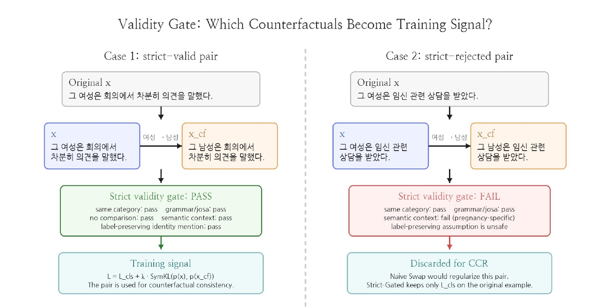
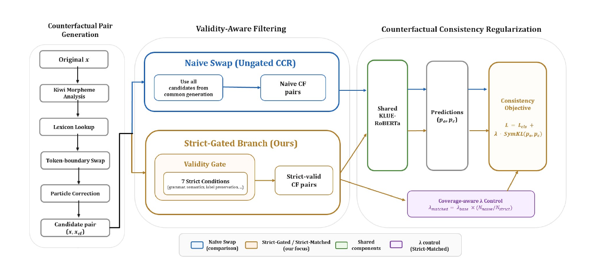
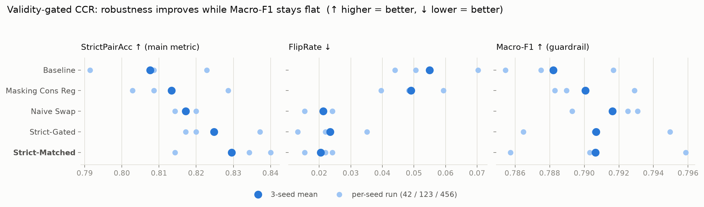
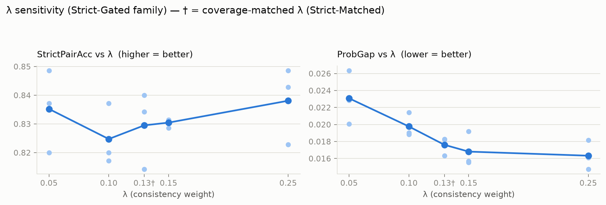

# Validity-Gated Counterfactual Consistency Regularization for Korean Hate/Offensive Language Detection

> Korea University COSE461 (자연어처리) Final Project — Team 11
> Minseo Shin · Soobin Cho · Nayeon Kim
> 데이터: [K-HATERS](https://huggingface.co/datasets/humane-lab/K-HATERS) · 모델: [`klue/roberta-base`](https://huggingface.co/klue/roberta-base) · 📄 **[논문 전문 (PDF)](docs/Team11_COSE461_paper.pdf)**

한국어 혐오/공격 표현 탐지 모델이 문맥이 아니라 **집단 지칭 단어 자체에 지름길처럼 반응하는 문제(identity-term shortcut)**를, **타당성이 검증된 counterfactual 쌍에만 일관성 제약을 거는 validity-gated counterfactual consistency regularization (CCR)**으로 완화한 프로젝트입니다. 핵심 발견: **"더 많은 쌍"보다 "validity gate를 통과한 더 깨끗한 쌍"이 robustness에 더 효과적**입니다 (23% 적은 쌍으로 더 높은 PairAcc/StrictPairAcc 달성).

> **TL;DR (English)** — Korean hate-speech classifiers often flip their prediction when only an identity term is swapped (e.g. *women's group* → *men's group*), revealing an identity-term shortcut. We regularize the model with a symmetric-KL consistency loss over counterfactual pairs, but only over pairs that pass a 7-condition **validity gate** (naive swaps in Korean frequently break meaning). With a coverage-matched regularization strength, the gated variant beats naive swapping on pair-level robustness using **23% fewer pairs**, while Macro-F1 stays flat — *cleaner pairs beat more pairs*.

**문서 구성**: [1. Introduction](#1-introduction--문제-정의) · [2. Approach](#2-approach--방법) · [3. Experiment](#3-experiment--실험-셋업) · [4. Results](#4-results--핵심-결과) · [5. Analysis](#5-analysis--분석) · [6. Conclusion](#6-conclusion--결론) · [한계](#7-한계--future-work) · [Related Work](#related-work--references) · [레포 구조](#8-레포-구조) · [재현](#9-실행--재현)

---

## 1. Introduction — 문제 정의

한국어 혐오 표현 탐지는 보통 일반 텍스트 분류로 다뤄지지만, **높은 aggregate 성능이 systematic한 약점을 가립니다.**

- **Identity-term shortcut**: 모델이 실제 abusive intent가 아니라 성별·종교·인종·나이·성적지향·장애를 가리키는 토큰 자체를 offensiveness의 강한 단서로 학습합니다.
- **Flip 현상**: 문맥은 그대로 두고 집단 단어만 바꾸면 예측이 뒤집힙니다. 예: `여가부·여성단체 … 미워할거양` → `offensive` (정답)인데, `여성단체`를 `남성단체`로만 교체하면 `not offensive` (오답). 같은 문장, 같은 의도인데 label이 flip.
- **중립 언급 오탐**: 단지 집단을 언급하기만 한 문장을 hateful로 오분류합니다.
- **Macro-F1로는 안 드러남**: aggregate 정확도는 높게 유지된 채로 이런 실패가 밑에 숨습니다.

**Research Question**: validity-gated counterfactual consistency가 base-task Macro-F1을 유지하면서 한국어 혐오/공격 표현 robustness를 개선하는가?

## 2. Approach — 방법

### 2.1 Counterfactual Consistency Regularization (CCR)

두 문장이 집단 단어만 다르고 label이 유지되어야 한다면, 모델은 두 문장에 일관된 예측을 해야 합니다. 원본 예측 분포 `p_o`와 counterfactual 예측 분포 `p_c` 사이의 **대칭 KL divergence**를 일관성 항으로 사용합니다.

```
Cons(p_o, p_c) = ½ · ( KL(p_o ‖ p_c) + KL(p_c ‖ p_o) )
L = L_cls + λ · Cons(p_o, p_c)
```

구현: `run_exp.py`의 `sym_kl()`. 일관성 항은 해당 조건에서 선택된 counterfactual 쌍에만 적용되며, 원본 logits는 classification forward에서 계산한 것을 anchor로 재사용합니다 (train-time dropout noise 감소).

### 2.2 Validity Gate (핵심 기여)

문제는 **모든 identity 교체가 label-preserving하지 않다는 것**입니다. 한국어는 조사·형태소·슬랭·맥락 의미가 얽혀 교체가 의미를 바꾸기 쉽습니다. 예: `트랜스젠더 → 이성애자` 교체인데 문장에 `자연임신` 맥락이 있으면 의미가 깨지고, 이런 쌍으로 학습하면 모델에 **잘못된 invariance**를 가르칩니다. 따라서 **생성(generation)과 타당성 검증(validity assessment)을 분리**하고, 게이트를 통과한 쌍에만 일관성 제약을 겁니다.



*게이트 동작 예시 (논문 Figure 2). Case 1은 7개 조건을 모두 통과해 CCR 학습 신호가 되고, Case 2는 `임신` 맥락 때문에 gender swap의 label 보존 가정이 깨져 거절됩니다 — Naive Swap이라면 이 쌍도 정규화에 사용합니다.*

### 2.3 Coverage-Aware Regularization

일관성 항은 valid counterfactual이 있는 예시에만 적용되므로, 실제 정규화 압력은 λ뿐 아니라 coverage `c = #{valid CF 학습 예시} / N_train`에도 의존합니다 (`λ_eff = λ × c`). **Strict-Matched** 조건은 strict gate를 유지하되 λ를 키워 `λ_eff`를 Naive Swap과 맞춥니다 — 비교 초점이 "총 정규화 양"이 아니라 **"게이트가 고른 쌍의 품질"**에 놓이게 하기 위함입니다.

### 2.4 방법 파이프라인 (Workflow)

**생성 → validity gate → CCR** 3단계. 생성은 후보를 만들 뿐, 학습에 안전한지는 게이트가 결정합니다.



*전체 프레임워크 (논문 Figure 1). 공통 생성 단계에서 만든 후보 7,735쌍을 Naive Swap은 그대로 쓰고, Strict-Gated 브랜치는 7개 strict 조건의 validity gate로 걸러 5,964쌍만 CCR에 사용합니다. Strict-Matched는 여기에 coverage-aware λ 제어를 더합니다.*

#### (a) Counterfactual pair 생성 (`dataset.py`)

- 6개 identity 범주 lexicon: **gender / religion / ethnicity / age / sexuality / disability** (`SWAP_PAIRS_BY_CAT`, 31개 swap terms). 대표 swap pair (논문 Appendix A.3): `여성↔남성`, `페미↔한남`, `무슬림↔기독교인`, `조선족↔한국인`, `노인↔청년`, `동성애자↔이성애자`, `장애인↔비장애인` 등
- **Kiwi** 형태소 분석으로 identity term 탐지 — term이 독립 토큰으로 등장해야 하고, 서로 다른 identity term이 2개 이상이면 제외 (`find_swap`)
- token-aware 치환 + **조사(josa) 자동 교정** — 받침 조건이 바뀌면 post-positional particle 조정 (`make_swap`, `_adjust_josa`)

#### (b) Validity Gate — 7 strict conditions (`compute_validity_strict`)

| # | 조건 | 코드 필드 | 막아내는 실패 모드 |
|---|---|---|---|
| 1 | Semantic blacklist | `valid_semantics` | 교체 시 사실·생물학적 비대칭이 생기는 맥락 (gender swap의 `임신`, religion swap의 `지하드`) |
| 2 | Asymmetric-pair exclusion | `label_preserving` | 사회적으로 label 보존이 성립하지 않는 방향 (`트랜스젠더 ↔ 이성애자`) |
| 3 | Comparison / relation filter | `no_comparison` | 이미 두 집단을 비교하는 문장 (`보다`, `반면` 등) |
| 4 | Harmful-object filter | `no_harmful_obj` | identity term이 사건 키워드(`폭행`, `강간`)와 목적어로 함께 등장 → 다른 사건 함의 |
| 5 | Age-decade filter | `no_age_contradiction` | 명시적 연령대 표현(`60대`)이 youth term과 교체되면 의미 모순 |
| 6 | Grammar correctness | `valid_grammar` | 치환 후 조사 결합이 ill-formed면 폐기 |
| 7 | Same-category constraint | `same_category` | 원본·치환 term이 같은 범주여야 함. by-construction으로 만족되어 binding filter로 작동하지는 않음 (완전성 위해 기록) |

- 결과: 학습 split의 swappable 후보 **7,735개 → strict gate 통과 5,964개 (약 77% retained)**
- 통과 쌍만 CCR 학습 신호로 사용, 탈락 쌍은 CCR에서 제외 (원본에는 `L_cls`만 적용)

## 3. Experiment — 실험 셋업

### 3.1 데이터

- **데이터**: K-HATERS repository split — 172,157 train / 10,000 val / 10,000 test. Binary label 매핑: `offensive`, `l1_hate`, `l2_hate` → 1 / `clean`, `exclude` → 0
- **테스트 쌍**: robustness 평가용 **455쌍**, 그중 strict-valid subset **350쌍**

### 3.2 학습 조건 (5개 + λ ablation)

| 조건 | 학습 신호 |
|---|---|
| Baseline | cross-entropy만 (λ=0) |
| Masking Cons Reg | identity term을 `[MASK]`로 가리고 동일 penalty (semantic 치환 없음, sanity 비교용) |
| Naive Swap | 생성된 **모든** identity swap에 CCR (7,735쌍, λ=0.1) |
| Strict-Gated | **strict-valid** swap에만 CCR (5,964쌍, λ=0.1) |
| Strict-Matched | strict-valid swap + coverage-matched λ (5,964쌍, λ=0.1297) |

> 코드에는 이 외에 중간 강도 게이트를 쓰는 `Validity-Gated` 모드(`mode='gated'`, base gate 통과 6,758쌍)도 구현되어 있으나, 논문 메인 비교에는 포함되지 않았습니다.

### 3.3 모델 / 학습 설정

- **모델/학습**: `klue/roberta-base`, CLS 토큰 위 단일 linear classifier, AdamW, lr `3e-5`, batch `64`, max seq len `128`, weight decay `0.01`, epochs `3`
- **Seeds**: 42, 123, 456 (결과는 3-seed 평균, seed별 best checkpoint는 validation Macro-F1로 선택)
- **λ ablation** (Strict-Gated family): λ ∈ {0.05, 0.10, 0.1297, 0.15, 0.25}

### 3.4 평가 지표

| 지표 | 역할 | 계산 대상 |
|---|---|---|
| **Macro-F1** | base-task guardrail (성능이 희생되지 않았는지) | test set (10,000) |
| **PairAcc** | 원본·counterfactual 둘 다 정답일 확률 | **455 robustness 쌍** |
| **StrictPairAcc** | 주 robustness 지표 (strict-valid 쌍 한정 PairAcc) | **350 strict-valid 쌍** |
| **FlipRate** | 교체 시 예측이 바뀌는 비율 (보조 진단, 낮을수록 좋음) | 쌍 집합 |
| **ProbGap** | 원본·counterfactual 간 confidence 차이 (낮을수록 안정) | 쌍 집합 |

FlipRate 단독으로는 "일관되게 둘 다 틀리는" 예측을 잡지 못하므로, correctness까지 요구하는 PairAcc/StrictPairAcc를 주 지표로 씁니다.

## 4. Results — 핵심 결과



### 메인 비교 (3-seed 평균 ± std; FlipRate·ProbGap ↓, 나머지 ↑)

| Method | Macro-F1 | FlipRate | ProbGap | PairAcc | StrictPairAcc |
|---|---|---|---|---|---|
| Baseline | 0.7882 ±0.0026 | 0.0549 ±0.0112 | 0.0440 ±0.0049 | 0.8029 ±0.0102 | 0.8076 ±0.0128 |
| Masking Cons Reg | 0.7901 ±0.0020 | 0.0491 ±0.0081 | 0.0435 ±0.0045 | 0.8110 ±0.0100 | 0.8133 ±0.0110 |
| Naive Swap | 0.7916 ±0.0017 | 0.0212 ±0.0041 | 0.0168 ±0.0006 | 0.8168 ±0.0037 | 0.8171 ±0.0023 |
| Strict-Gated | 0.7907 ±0.0035 | 0.0234 ±0.0090 | 0.0198 ±0.0012 | 0.8220 ±0.0047 | 0.8248 ±0.0088 |
| **Strict-Matched** | 0.7906 ±0.0041 | **0.0205** ±0.0037 | 0.0176 ±0.0009 | **0.8264** ±0.0031 | **0.8295** ±0.0110 |

- **"Cleaner beats more"**: Strict-Matched가 PairAcc·StrictPairAcc 모두 최고 — Naive Swap 대비 각각 **+0.0096 / +0.0124** — 를 **23% 적은 쌍(5,964 vs 7,735)**으로 달성.
- **Macro-F1은 전 조건 0.788~0.792의 좁은 범위 유지** → robustness 개선이 분류 성능을 희생시키지 않음.
- Masking Cons Reg는 PairAcc를 조금만 올리고 FlipRate는 baseline 근처 → 일관성 penalty 자체가 아니라 **semantic하게 grounded된 대조 쌍 구조가 중요**함을 시사.
- ⚠️ **통계적 주의**: Strict-Matched vs Naive Swap의 StrictPairAcc 차이(+0.0124)는 seed 간 std(±0.011)와 비슷한 크기입니다. 방향의 일관성은 [§5.2 control check](#52-control-check--게이트-이점은-λ-tuning-아티팩트가-아님)(5개 λ 전부에서 gated가 우세)가 뒷받침하지만, 3-seed 기준 1 std 이내 차이는 신중히 해석해야 합니다 ([§7 한계](#7-한계--future-work)).
- 표기 참고: 이 README의 ±std는 `compare_results.py`가 raw JSON에서 계산한 값(population std)입니다. 논문 표의 일부 행(Masking, λ=0.05/0.25 — 별도 run 파일에서 집계된 행)은 sample std로 표기되어 값이 약 1.22배 크지만, **평균값은 모두 동일**합니다.

<details>
<summary><b>Strict-variant 보조 지표</b> — 350 strict-valid 쌍 기준 FlipRate·ProbGap (논문 Table 6)</summary>

| Method | S-FlipRate ↓ | S-ProbGap ↓ |
|---|---|---|
| Baseline | 0.0543 ±0.0123 | 0.0447 ±0.0034 |
| Naive Swap | 0.0229 ±0.0040 | 0.0165 ±0.0009 |
| Strict-Gated | 0.0219 ±0.0097 | 0.0190 ±0.0008 |
| **Strict-Matched** | **0.0200** ±0.0084 | 0.0166 ±0.0006 |
| Masking Cons Reg | 0.0495 ±0.0067 | 0.0452 ±0.0040 |

</details>

### Coverage & 유효 강도

| Condition | Pairs | c | λ | λ_eff |
|---|---|---|---|---|
| Naive Swap | 7,735 | 0.04493 | 0.100 | 0.00449 |
| Strict-Gated | 5,964 | 0.03464 | 0.100 | 0.00346 |
| Strict-Matched | 5,964 | 0.03464 | 0.1297 | 0.00449 |

### λ 민감도 (Strict-Gated family)



| λ | Macro-F1 | PairAcc | StrictPairAcc | ProbGap |
|---|---|---|---|---|
| 0.05 | 0.7917 | 0.8293 | 0.8352 | 0.0231 |
| 0.10 | 0.7907 | 0.8220 | 0.8248 | 0.0198 |
| 0.1297† | 0.7906 | 0.8264 | 0.8295 | 0.0176 |
| 0.15 | 0.7917 | 0.8249 | 0.8305 | 0.0168 |
| 0.25 | 0.7898 | 0.8300 | **0.8381** | 0.0163 |

`†` = Strict-Matched (coverage-matched λ). ± std 포함 전체 표는 [`results/tables/final_results_table.md`](results/tables/final_results_table.md) 참고.

### 결과 파일 출처

위 표의 수치는 `results/raw/`의 JSON과 대조 확인되었습니다: 메인 표 → `results_core_followup.json`(+ `results_masking.json`), λ=0.05 → `results_strict_lam005.json`, λ=0.25 → `results_strict_lam025.json`, λ=0.15 → `results_core_followup.json`의 `Strict_lam=0.15` 행. 결과 그림 2개(`fig_main_results`, `fig_lambda_sensitivity`)는 `assets/make_figures.py`가 같은 JSON에서 직접 생성하고, 방법 그림 2개(`fig_framework_overview`, `fig_validity_gate_example`)는 [논문](docs/Team11_COSE461_paper.pdf)의 Figure 1·2입니다. 전체 비교표·claim assessment는 `results/summaries/compare_all_methods.txt`.

## 5. Analysis — 분석

### 5.1 PairAcc 분해 — 게이트는 어디서 이득을 주는가 (논문 §Analysis)

`PairAcc = Origcorrect × consistency`로 분해하면 (Origcorrect: 원본이 맞을 확률, consistency: 맞은 원본의 counterfactual도 맞을 확률):

- 두 CCR 변형 모두 PairAcc 개선의 대부분은 **consistency**에서 옵니다 (Naive +0.0332±0.0088 / Strict-Matched +0.0342±0.0084).
- 그러나 Strict-Matched가 Naive Swap을 넘어서는 **추가 이점(Δ=0.0095±0.0055)은 거의 전부 Origcorrect 성분**(+0.0086, ≈90%)에서 옵니다.
- 해석: strict gate는 pair-level 일관성을 더 조인다기보다, **per-example 정확도를 깎아먹는 invalid 쌍을 제거**하는 방식으로 도움을 줍니다.

### 5.2 Control check — 게이트 이점은 λ tuning 아티팩트가 아님 (논문 Table 7)

동일 λ grid {0.05, 0.10, 0.1297, 0.15, 0.25}에서 Strict-Gated가 Naive Swap을 **5개 λ 전부에서** StrictPairAcc로 앞섭니다:

| λ | Naive Swap | Strict-Gated | Δ |
|---|---|---|---|
| 0.05 | 0.8229 ±.0057 | **0.8352** ±.0144 | +0.0123 |
| 0.10 | 0.8171 ±.0023 | **0.8248** ±.0088 | +0.0077 |
| 0.1297† | 0.8286 ±.0029 | **0.8295** ±.0110 | +0.0009 |
| 0.15 | 0.8190 ±.0044 | **0.8305** ±.0013 | +0.0115 |
| 0.25 | 0.8295 ±.0059 | **0.8381** ±.0135 | +0.0086 |

`†` = Strict-Matched에 해당하는 λ. 즉 게이트의 이점은 특정 hyperparameter 선택의 결과가 아니라 invalid 쌍 필터링 자체의 효과입니다. 특히 **λ=0.05에서도 Strict-Gated가 Naive Swap을 앞선다**는 것은, coverage-matched scaling 없이 낮은 정규화 압력에서도 label-unsafe 쌍 필터링만으로 robustness가 개선됨을 보여줍니다 — gate 품질과 정규화 강도는 서로 대체재가 아니라 보완재입니다. (Naive Swap 쪽 λ sweep의 raw JSON은 이 레포에 포함되어 있지 않으며, 수치는 논문 Table 7 기준입니다.)

### 5.3 λ 민감도 해석

ProbGap은 λ 증가에 따라 **단조 감소**(0.0231 → 0.0163)하지만 StrictPairAcc는 **비단조**(λ=0.10에서 dip 후 λ=0.25에서 최고 0.8381)입니다 → 강한 정규화는 confidence를 꾸준히 안정화하지만, calibration 안정성과 correctness-aware robustness는 관련 있을 뿐 동일하지 않습니다.

### 5.4 정성 분석 (논문 Table 4 기준)

- 게이트가 테스트 455쌍 중 **105쌍(23.1%) 거절** → 350 strict-valid 쌍.
- 350 strict-valid 쌍에서 flip이 Baseline **19쌍(5.4%)** → Strict-Matched **7쌍(2.0%)**로 감소. ⚠️ 이 수치는 논문에 seed 42 기준으로 보고된 것으로, 메인 표의 FlipRate(3-seed 평균, 455쌍 기준 0.0549→0.0205)와는 **별개의 수치**입니다.
- 대표 사례 세 가지 (논문 Table 4의 5개 예시 중):
  - **Gate accept**: `여성단체→남성단체`, `동성애자→이성애자` — 같은 abusive intent인데 Baseline이 flip. 게이트 통과 → swap 기반 CCR 세 조건 모두 flip 제거.
  - **Gate reject**: `트랜스젠더→이성애자` + `자연임신` 맥락(교체가 사실 관계를 깨뜨림), `여성인권→남성인권` + 역사적 불평등 맥락(사회적 의미가 반전됨) — Naive Swap은 학습에 쓰지만 게이트는 거절.
  - **Residual failure**: 결정 경계 근처 (원본 p=0.493 정답 → 교체 후 p=0.576로 경계 넘음). Strict-Matched도 margin에서는 여전히 flip → confidence-weighted consistency가 future work인 이유.

## 6. Conclusion — 결론

1. **Identity 교체는 정규화에 쓰기 전 label 보존 여부를 검증해야 합니다.** 한국어에서 naive 치환은 invalid 학습 신호를 만듭니다.
2. **깨끗한 쌍 선택이 coverage 최대화보다 유용할 수 있습니다.** Strict-Matched가 23% 적은 쌍으로 Naive Swap을 앞섰고, 그 이점은 주로 per-example 정확도를 해치는 쌍을 제거한 데서 옵니다 (§5.1).
3. **Correctness가 중요할 때 PairAcc가 FlipRate보다 유익한 진단입니다.** FlipRate는 "일관되게 틀리는" 예측을 못 잡지만, PairAcc는 원본·counterfactual 둘 다 정답을 요구합니다.

## 7. 한계 & Future Work

- **Rule-based gate**라 미묘한 pragmatic validity 실패를 놓칠 수 있음.
- **테스트 쌍도 동일 rule-based 시스템으로 생성** → OOD 치환에 대한 robustness를 과대평가할 여지.
- **단일 데이터셋·단일 encoder family**, seed 3개 → 1 std 이내 차이는 신중히 해석 (§4 메인 표의 std 참고).
- Swap map이 one-directional (여러 minority term의 counterpart가 겹치는 reverse swap의 모호성 회피).
- λ_eff 균등화로도 23% coverage gap이 완전히 해소되지는 않음 (gate composition이 부분적 confound).
- 방향: learned validity gating (NLI 기반 label-preservation 검사), 더 큰/multilingual 모델, confidence-weighted consistency.

## Related Work & References

이 프로젝트가 딛고 있는 세 갈래의 선행 연구 (논문 §2, 전체 서지는 [논문 PDF](docs/Team11_COSE461_paper.pdf) References 참고):

- **한국어 혐오 표현 데이터셋** — K-HATERS (Park et al., 2023) [본 프로젝트의 학습·평가 데이터], KOLD (Jeong et al., 2022), K-MHaS (Lee et al., 2022). 기존 연구가 분류 성능에 집중했다면, 이 프로젝트는 **identity-term counterfactual에 대한 일관성**을 묻습니다.
- **Toxicity 분류기의 identity bias** — Dixon et al. (2018)은 중립적인 identity 언급 문장에 높은 toxicity 점수가 부여되는 unintended bias를 보였습니다. 본 프로젝트의 한국어 버전 문제의식입니다.
- **Counterfactual fairness / augmentation** — Garg et al. (2019), Wang & Culotta (2021), Kaushik et al. (2020). 이 계열은 대체로 **모든 identity swap을 valid로 가정**하지만, 본 프로젝트는 한국어에서는 그 가정이 자주 깨진다는 점에서 출발해 생성과 validity 검증을 분리합니다. 일관성 손실 형태는 consistency regularization (Tarvainen & Valpola, 2017)을 따릅니다.

## 8. 레포 구조

```
nlp-korean/
├── README.md                        # 이 문서
├── PROJECT_CONTEXT.md               # 논문·발표자료에서 추출한 검증된 사실 (ground truth)
├── assets/                          # README 그림 + 생성 스크립트
│   ├── make_figures.py              #   results/raw JSON → 결과 그림 재생성
│   ├── fig_main_results.png         #   메인 비교 (레포 데이터로 생성)
│   ├── fig_lambda_sensitivity.png   #   λ 민감도 (레포 데이터로 생성)
│   ├── fig_framework_overview.png   #   논문 Figure 1 (프레임워크 개요)
│   └── fig_validity_gate_example.png#   논문 Figure 2 (게이트 accept/reject 예시)
├── docs/                            # 논문 + 개발 과정 문서 (역사적 기록, 최종 결과와 모순 없음)
│   ├── Team11_COSE461_paper.pdf     # ★ 최종 논문 전문
│   ├── PROJECT_PROPOSAL.md          #   제안서
│   ├── PROJECT_DIRECTION.md         #   방향 결정 노트 (claim 형태·리스크)
│   ├── ABLATION_PLAN.md             #   λ ablation 계획·해석 가이드
│   ├── CONFIRMED_RESULTS_2026_05_24.md  # 2026-05-24 확정 결과 스냅샷
│   ├── PAPER_DRAFT.md               #   보고서 초안
│   ├── REPORT_WRITEUP_TEMPLATE.md   #   보고서 작성 템플릿
│   └── TEAM_ONBOARDING.md           #   팀 온보딩 (방법·claim 결정 트리)
├── results/                         # 공유용 report-grade 결과물
│   ├── README.md                    #   결과 공유 규칙 (파일명·검증 절차)
│   ├── raw/                         #   run_exp.py 최종 JSON 4개
│   ├── tables/                      #   CSV 요약 3개 + final_results_table.md (±std 전체 표)
│   ├── logs/                        #   메인 run 학습 로그 (train_core_followup.log)
│   └── summaries/                   #   compare_results.py 전체 출력 (compare_all_methods.txt)
├── tests/                           # 유틸리티 스크립트 단위 테스트 (61개, 통과 확인)
└── validity_gated_exp/              # 실험 코드 + 실행 문서
    ├── run_exp.py                   # 메인 실험 러너 (학습·평가·결과 저장·t-test)
    ├── dataset.py                   # K-HATERS 로딩, identity swap 생성, validity gate 구현
    ├── experiment_utils.py          # coverage-matched λ, 결과 병합/재개, error example 수집
    ├── check_data.py                # 데이터·CF pair 생성 사전 점검
    ├── analyze_cf_pairs.py          # CF 구축 통계·rejection breakdown (GPU 불필요)
    ├── compare_results.py           # 결과 JSON 비교표·claim assessment (stdlib만 사용)
    ├── env_check.py                 # 학습 전 환경 검사 (패키지·디스크·CUDA·git 상태)
    ├── preflight_run.py             # 실험 커맨드 사전 검증 (torch 불필요)
    ├── requirements.txt             # 전체 의존성 (torch 포함)
    ├── requirements-runtime.txt     # torch 제외 런타임 의존성
    ├── data/                        # 생성물 자리 (cf_pairs_train.jsonl 등, gitignore)
    ├── RUNNING.md                   # ★ 실행 runbook (환경 → 검증 → 실험 → 비교)
    └── JUPYTER_RUN_SHEET.md         # report-grade run 체크리스트
```

- 생성물(checkpoint, log, 임시 JSON/CSV, 생성된 CF 쌍)은 gitignore 대상이며, 공유용 최종 JSON만 `results/raw/`에 복사하는 규칙입니다 (`results/README.md` 참고).
- 원본 레포는 `angellashin` 계정입니다 (clone 주소는 `nlp-korean`, 논문 인용 표기는 `261RCOSE46101`). 이 레포는 그 fork 사본입니다. 과거의 `Soob00/hi` clone에서 이어서 작업하지 않습니다.

## 9. 실행 / 재현

전체 절차(환경 구성 → 데이터 검증 → smoke test → 본 실험 → 결과 비교)는 **[`validity_gated_exp/RUNNING.md`](validity_gated_exp/RUNNING.md)** 를 따르세요. 요약:

```bash
# 1) 환경 검사 (학습 전 필수)
python validity_gated_exp/env_check.py --require_cuda --min_free_gb 15

# 2) 데이터 & CF pair 생성 확인
python validity_gated_exp/check_data.py

# 3) 커맨드 사전 검증 (torch 불필요)
python validity_gated_exp/preflight_run.py \
  --exp Baseline "Naive Swap" Strict-Gated Strict-Matched Strict_lam=0.15 Strict_lam=0.25 \
  --seeds 42 123 456 --epochs 3 --batch_size 64 \
  --result_path validity_gated_exp/results_core_followup.json --require_core

# 4) 본 실험 (위와 동일 인자로 run_exp.py 실행)
python validity_gated_exp/run_exp.py --exp Baseline "Naive Swap" Strict-Gated Strict-Matched \
  --seeds 42 123 456 --epochs 3 --batch_size 64 \
  --result_path validity_gated_exp/results_core_followup.json 2>&1 | tee train_core_followup.log

# 5) 결과 비교 (비교표 + claim assessment + Markdown 표)
python validity_gated_exp/compare_results.py results/raw/results_core_followup.json

# 6) README 그림 재생성 (matplotlib 필요)
python assets/make_figures.py
```

유틸리티 스크립트 테스트: `python -m unittest discover -s tests`

## 팀 기여 (논문 Appendix A.1)

- **Minseo Shin** — 학습 파이프라인, main 실험 (Baseline / Naive Swap / Strict-Gated)
- **Soobin Cho** — 프로젝트 방향, method 설계, CF 쌍 구성, validity-gated 학습
- **Nayeon Kim** — 평가·결과 분석, error-case 검사, figure/table, Naive Swap λ sensitivity, Results/Analysis/Conclusion 작성
